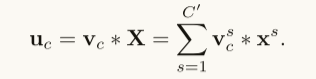
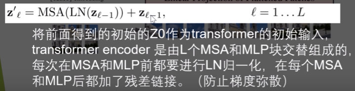
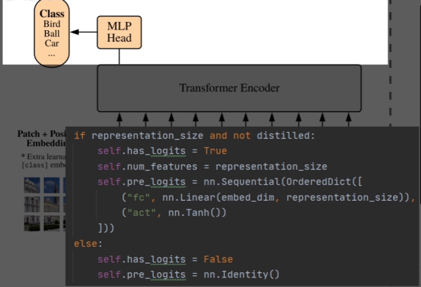

# cs230 DeepLearning

## Part Ⅳ 卷积神经网络CNN
Example 1 ：边缘检测：区分从暗到亮 再从亮到暗的边缘

介于中间的值 像-10 反映了过滤器捕捉到了 左边正边界的一部分和右边负边界的一部分 因此混合在一起 从而得到介于两者之间的值 如果这是一个非常大的图片 比方说这是一个1000乘1000的图片 同样是棋盘形式 那么就不会有这些元素为10的过渡区域 这些过渡值相对于 图片的大小会非常小

Sobel kernal 强化中间的值，往往可以自己学习kernal参数
Valid卷积和 same卷积

通常在计算机视觉(computer vision)领域 f基本上是使用奇数 事实上几乎永远是奇数 并且你很少看到偶数大小的 计算机视觉使用的过滤器 并且我想有两个原因导致这个现象 一是如果f是偶数 你会需要一些不对称的填充 所以只有当f是奇数时 这种same卷积会产生 在四周有相同的维度的一个自然的填充区域 而不是在左边多填充在右边少填充 或者别的不对称的填充 其次当你有一个奇数大小的过滤器 比如3x3或者5x5 这样这可以有一个中心位置 有时候在计算机视觉领域 有一个特殊点是很好的 有一个这样的像素是很好的 你可以称之为中心像素 这样你就可以描述你过滤器的位置

多通道卷积涉及到“立方体”的比喻概念

### 卷积神经网络
了解其结构、一对一卷积可以缩小通道数，池化操作（通常不认为是一个卷积层，因为没有需要训练的参数）可以缩小宽和高

### Inception Network is important
事实上是通过增加Bottleneck层来减少计算资源的消耗（瓶颈卷积）

### Mobile Net
轻量化的计算模型

Depthwise卷积运算（深度可分离） 成本更小

### YOLO 目标检测算法

### U-Net 语义分割
首先要了解的是转置卷积以及这一个架构的高层直觉是什么，最后你就可以了解他的整体架构。

### Siamese网络 
解决的是人脸识别（单样本学习）问题。涉及到一个标题中的特殊网络

### 神经风格转移

## 序列模型

重点关注RNN及其相关变形、优化、拓展，如RNN，双向RNN，深层RNN，GRU，LSTM，Attention，Head（Multihead），Transformer。重点关注Transformer。

# Paper Ⅰ  Deep Residual Learning
## 概念部分
**问题**： 随着网络深度的增加，准确率达到饱和然后迅速退化
**网络退化概念**：神经网络随着层数加深，首先训练准确率会逐渐趋于饱和；若层数继续加深，反而训练准确率下降，效果不好了，而这种下降不是由过拟合造成的（因为如果是过拟合的话，训练时误差应该很低而测试时很高）。
**Q：为啥会出现网络退化？**
由于非线性激活函数Relu的存在，每次输入到输出的过程都几乎是不可逆的，这也造成了许多不可逆的信息损失。一个特征的一些有用的信息损失了，得到的结果肯定不尽人意。说通俗一点就是中间商赚差价。层数增多之后，信息在中间层损失掉了。

解决深度神经网络随着层数增加，复杂性增加，模型的预测准确率反而下降的问题。基本方法是使用了一个没有参数的快捷链接。若最优的映射是恒等映射，则将残差逼近为 0 会比用一堆非线性层去拟合恒等映射更容易。

存在着一个交换论证：无法找到一个比使用恒等映射的方法更优秀或至少相等的算法。

因此，与其期望堆叠层去逼近 $H ( x )$，我们明确要求这些层去逼近残差函数：

$F ( x ) : = H ( x ) − x$

于是，原始函数可重写为：

$H ( x ) = F ( x ) + x$

论文的一个主要观点是，如果最优函数更接近恒等映射而不是零映射，那么基于恒等映射进行微调比从零开始学习新函数更容易实现优化。

$$y=F(x,\{W_i\})+x \tag 1$$

是优化的目标函数

在公式 $(1)$ 中，$x$和 $F$ 的维度必须一致。如果维度不一致（例如在改变输入/输出通道时），我们可以通过快捷连接添加一个线性映射$W_s$来匹配维度。

当维度发生变化（图 3 中的虚线快捷路径）时，我们考虑两种处理方式：

- 选项 A：快捷路径仍执行恒等映射，对维度扩展部分进行零填充（zero-padding）。该方式不引入额外参数；
- 选项 B：使用公式 (2) 中的投影映射来匹配维度（通过 1 × 1卷积实现）：
$$y = F ( x , \{ W i \} ) + W_s x \tag 2$$

无论哪种方式，当快捷路径跨越不同尺寸的特征图时，其操作都采用步幅为 2 来实现下采样。以上符号同样适用于卷积层。

我们在 ImageNet 上的实现遵循了 [21, 40] 中的做法。图像会被缩放，其较短边随机采样于 [256, 480] 范围内进行尺度增强（scale augmentation）[40]。然后从图像或其水平翻转版本中随机裁剪出一个 224×224 的区域，并减去每个像素的均值 [21]。我们使用了 [21] 中的标准颜色增强方法。

我们采用了批归一化（Batch Normalization, BN）[16]，在每个卷积层之后、激活函数之前进行，遵循 [16] 的做法。权重初始化采用 [12] 的方法，所有的 plain/residual 网络都是从头开始训练的。

我们使用 SGD 优化器，mini-batch 大小为 256。初始学习率设为 0.1，当误差不再下降时将学习率除以 10。模型最多训练 60 × 10⁴ 次迭代。权重衰减为 0.0001，动量为 0.9。我们没有使用 dropout [13]，这也是 [16] 中的实践。

在测试阶段，为了做对比研究，我们采用标准的 10-crop 测试方法 [21]。为了获得最佳结果，我们采用了 [40, 12] 中提出的全卷积形式（fully-convolutional form），并在多个尺度上对得分进行平均（图像的较短边被缩放到 {224, 256, 384, 480, 640} 这些值中）。

在表 3 中，我们比较了三种选择：

- A：在维度增加时使用零填充，所有 shortcut 都是无参数的（与表 2 和图 4 右相同）；
- B：在维度增加时使用投影 shortcut，其他 shortcut 为恒等映射；
- C：所有 shortcut 都使用投影。

表 3 显示这三种方案的性能都远优于 plain 网络。B 略优于 A，我们认为这是因为 A 中的零填充部分并没有参与残差学习。C 略优于 B，我们认为是因为 B 中使用了 13 个投影 shortcut，引入了额外的参数。但 A/B/C 三者之间差距很小，说明投影 shortcut 并非解决退化问题的关键。

因此，为了减少内存、时间复杂度和模型大小，在后续实验中我们不再使用选项 C。特别地，在接下来的瓶颈结构（bottleneck architectures） 中，恒等 shortcut 是非常重要的，它们不会增加复杂度。

**Bottleneck**主要用在ResNet50及以上的网络结构，与BasicBlock不同的是这里有 3 个卷积，分别为 1\*1，3\*3，1\*1大小的卷积核，分别用于压缩维度、卷积处理、恢复维度。
这里的通道数是变化的，1\*1卷积层的作用就是用于改变特征图的通数，使得可以和恒等映射x相叠加，另外这里的1*1卷积层改变维度的很重要的一点是可以降低网络参数量，这也是为什么更深层的网络采用BottleNeck而不是BasicBlock的原因。

## 实验部分

# Paper Ⅱ GoogleNet
主要问题：将Inception体系结构与残差连接相结合是否有任何好处?
Inception体系在课程中已经介绍过，在此处就不再多说，本篇论文的主要思想是将两者结合，构造一个足够复杂和足够深的网络。

# Paper Ⅲ Densely Connected Convolutional Networks
如果卷积网络中靠近输入的层和接近输出的层之间有较短的连接，那么它们就可以更深入、更准确、更有效地进行训练

确保网络各层之间的最大信息流，我们将所有层（具有匹配的特征图大小）直接相互连接，为了保持前馈性质，每个层从所有前面的层获取额外的输入，并将其自己的特征图传递到所有后续层，下图展示了网络结构：

具体可以查看论文的结构图，总的来说就是一个全连接层

# Paper Squeeze-and-Excitation Networks
特征图中的不同通道(channel)代表不同的对象，通道注意力显式建模通道之间的相互依赖性，通过网络自适应学习每个通道的重要程度，并为每个通道赋予不同的权重系数，从而来强化重要的特征，抑制非重要的特征。

Squeeze和Excitation是SENet的两个核心步骤。Squeeze是指在空间维度上收集全局信息，并将其压缩为一个全局向量表示。Excitation模块对全局向量进行非线性变换，并通过sigmoid函数生成权重向量，然后再使用权重向量与输入相乘，从而加强通道上有用的特征，抑制通道上不重要的特征。

接下来重点解释一下各个参数的理论意义。

$$Ftr : X → U, X ∈ R(H′×W′×C′) ,U ∈ R(H×W×C)$$

在本篇论文的符号中，我们将 $$F_tr$$ 视为卷积算子。

本模型的解决目的是正确区分滤波器间的相关关系与通道（或者说信道）的相关关系。

# Paper CBAM: Convolutional Block Attention Module

CBAM 是一种能够集成到任何卷积神经网络架构中的注意力模块。它的核心目标是通过学习的方式，自动获取特征图在通道和空间维度上的重要性，进而对特征图进行自适应调整，增强重要特征，抑制不重要特征，提升模型的特征表达能力和性能。简单来说，它就像是给模型装上了 “智能眼镜”，让模型能够更精准地看到图像中关键的部分。

CBAM 由两个主要部分组成：通道注意力模块（Channel Attention Module）和空间注意力模块（Spatial Attention Module）。这两个模块顺序连接，共同作用于输入的特征图。下面我们结合图片（如下）来详细讲解。

我们通过利用特征的通道间关系来生成通道注意力图。 由于特征图的每个通道都被视为特征检测器，因此通道注意力集中在给定输入图像的情况下“什么”是有意义的。 为了有效地计算通道注意力，我们压缩输入特征图的空间维度。 为了聚合空间信息，迄今为止普遍采用平均池化。

周等人建议使用它来有效地学习目标对象的范围，Hu等人在他们的注意力模块中采用它来计算空间统计。 除了之前的工作之外，我们认为最大池收集了关于独特对象特征的另一个重要线索，以推断更精细的通道注意力。 因此，我们同时使用平均池化和最大池化特征。 我们凭经验证实，利用这两个特征可以极大地提高网络的表示能力，而不是单独使用每个特征（参见第 4.1 节），这表明了我们设计选择的有效性。 下面我们描述详细操作。

给定输入图像，两个注意力模块（通道和空间）计算互补注意力，分别已关注“什么”和“哪里”。 考虑到这一点，两个模块可以并行或顺序放置。 我们发现顺序排列比并行排列提供更好的结果。 对于顺序过程的安排，我们的实验结果表明，通道优先顺序略好于空间优先顺序。

# Paper ViT
做的事情是把RNN与CNN相融合，使序列模型能够真正用于图像处理问题。

采用一维的Pos编码

# Paper Swin Transformer
修复了ViT模型信息缺失的问题。

Patch Patrition事实上是用于提取特征的一个卷积操作，Linear Embedding操作就是将二维数据展开成一个一维的数据。

input: (1, 3, 224, 224) → 不进行图形分块
patch partition: (1, 96, 56, 56) → 类似池化操作，聚合空间维度信息。实际的实现就是通过卷积操作进行的。作者使用了一个卷积核4*4，步长也为4的卷积核来进行。
linear embedding: (1, 3136, 96) → 将特征图打散，通道维度仍然保留，并交换他们的位置。

# Paper PVTv1 PVTv2 P2T

# Paper FastViT

本文的目标是做一个卷积，Attention 的低延时混合架构，因为这种架构有效地结合了 CNN 和 Transformer 的优势，在多个视觉任务上有竞争力。重点是在主流现成硬件（如擅长并行计算的 GPU）上实现计算机视觉任务的最高吞吐量。在这种情况下，计算涉及一组以 CUDA 和张量内核为计算单元的流式多处理器（SM）。计算需要频繁传输数据，并可能受到数据移动带宽的影响。因此，受计算约束的操作是数学限制的，而受内存传输约束的操作是内存限制的。它需要在二者之间取得谨慎的平衡，以最大限度地提高吞吐量。

